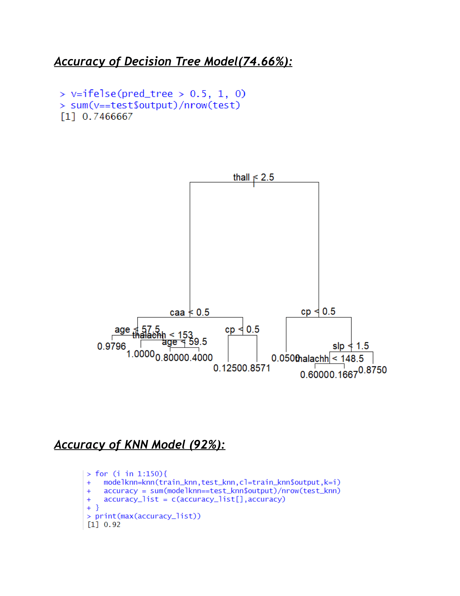

# Heart-Disease-Prediction
The objective of this projectis to create a machine learning model that can precisely forecast a person's risk of developing heart disease based on personal and medical data.

